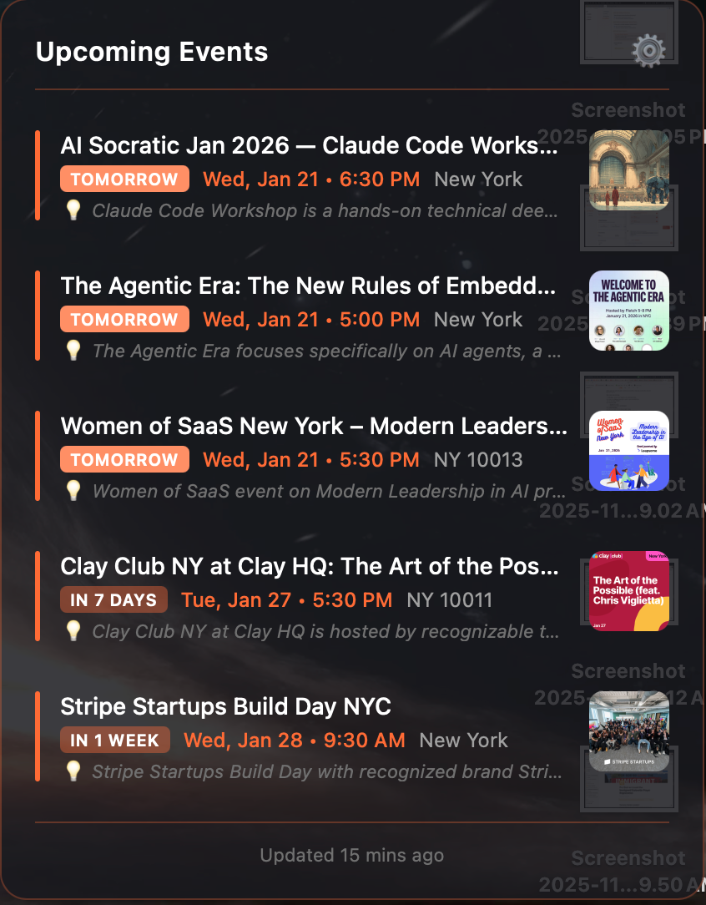

# Luma Events Widget

Automated event discovery from [lu.ma](https://lu.ma) with AI-powered filtering and a macOS desktop widget.



## Features

- **Scrapes events** from configurable lu.ma pages (city hubs, calendars)
- **AI filtering** using Claude to select the most relevant events based on your interests
- **Desktop widget** for [Übersicht](http://tracesof.net/uebersicht/) - always visible on your desktop
- **Daily automation** via macOS launchd with catchup logic

## Quick Start

```bash
# Clone the repository
git clone https://github.com/DanielOrtiz0220/luma-events-widget.git
cd luma-events-widget

# Install dependencies
npm install

# Set up environment
cp .env.example .env
# Edit .env and add your ANTHROPIC_API_KEY

# Set up configuration
cp config/config.example.json config/config.json
# Edit config.json with your lu.ma URLs and filter preferences

# Run manually
npm run scrape   # Scrape events from lu.ma
npm run filter   # Filter events with Claude AI
```

## Übersicht Widget

1. Install [Übersicht](http://tracesof.net/uebersicht/) if you haven't already
2. Copy the widget folder to Übersicht's widgets directory:
   ```bash
   cp -r widget/luma-events.widget ~/Library/Application\ Support/Übersicht/widgets/
   ```
3. Edit `~/Library/Application Support/Übersicht/widgets/luma-events.widget/index.jsx` and update the paths at the top to match your installation

## Configuration

Edit `config/config.json`:

```json
{
  "urls": [
    "https://lu.ma/sf/tech",
    "https://lu.ma/nyc/ai"
  ],
  "filterText": "Your interests for AI filtering...",
  "daysAhead": 14
}
```

- **urls**: lu.ma pages to scrape (city hubs, calendars, etc.)
- **filterText**: Describe your interests - Claude uses this to select relevant events
- **daysAhead**: How far ahead to look for events

## Automation (macOS)

To run the scraper daily:

1. Copy and edit the launchd plist:
   ```bash
   cp launchd/com.example.luma-events.plist ~/Library/LaunchAgents/com.luma-events.plist
   ```
2. Edit the plist and replace `YOUR_USERNAME` and paths
3. Load the agent:
   ```bash
   launchctl load ~/Library/LaunchAgents/com.luma-events.plist
   ```

The scheduler includes catchup logic - if your Mac was asleep during the scheduled time, it will run when it wakes up.

## Scripts

- `npm run scrape` - Scrape events from configured lu.ma URLs
- `npm run filter` - Filter events using Claude AI
- `npm run run` - Run both scrape and filter
- `npm run catchup` - Run with catchup logic (for scheduled runs)

## Requirements

- Node.js 18+
- [Anthropic API key](https://console.anthropic.com/) for Claude
- [Übersicht](http://tracesof.net/uebersicht/) for the desktop widget (optional)
- macOS for launchd automation (optional)

## License

MIT
